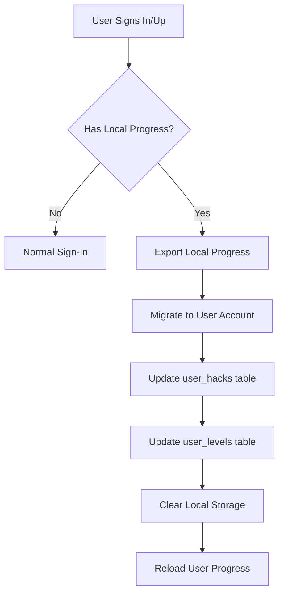

# Anonymous User Progression System

## Overview

The NRGHax levels system now supports **anonymous (non-authenticated) user progression** using browser local storage. This allows users to explore the platform and track their progress before signing up.

## Key Features

### 1. **Local Storage Based Progress**
- Anonymous users' hack/level completion is saved in browser localStorage
- Progress persists across browser sessions
- No authentication required

### 2. **Automatic Progress Migration**
- When an anonymous user signs up or signs in, their local progress is automatically migrated to their account
- Migration happens seamlessly in the background
- Local storage is cleared after successful migration

### 3. **Identical UX**
- Anonymous users see the same level tree and progression interface
- Progress bars, completion badges, and unlock logic work identically
- The only difference is a "Guest Mode" notice with a sign-in prompt

## Architecture

### Local Storage Schema

```typescript
// Stored in: nrghax_hack_progress
{
  [hackId]: {
    hackId: string
    completed: boolean
    completedAt: string | null
    viewCount: number
    lastViewedAt: string | null
  }
}

// Stored in: nrghax_level_progress
{
  [levelId]: {
    levelId: string
    hacksCompleted: number
    totalRequiredHacks: number
    completedAt: string | null
    lastUpdatedAt: string
  }
}
```

### File Structure

```
src/
├── lib/
│   └── levels/
│       ├── localStorage.ts        # Local storage utilities
│       ├── clientActions.ts       # Client-side progress tracking
│       ├── migrateProgress.ts     # Server action for migration
│       └── actions.ts            # Server actions (existing)
├── components/
│   └── levels/
│       ├── ClientLevelTree.tsx    # Client-side level tree
│       ├── ClientLevelDetail.tsx  # Client-side level detail
│       └── ProgressMigrator.tsx   # Auto-migration component
├── hooks/
│   └── useProgressMigration.ts   # Migration hook
└── app/
    └── levels/
        ├── page.tsx              # Updated to support both modes
        ├── [slug]/page.tsx       # Updated level detail page
        └── layout.tsx            # Includes ProgressMigrator
```

## How It Works

### For Anonymous Users

1. **Visit /levels** - No sign-in required
2. **Browse levels** - See all levels and their prerequisites
3. **Complete hacks** - Progress saved to localStorage
4. **Unlock new levels** - Based on completed prerequisites
5. **Progress persists** - Saved across browser sessions

### Level Unlocking Logic

```typescript
// A level is unlocked if:
// 1. It has no prerequisites (e.g., Foundation level), OR
// 2. All prerequisite levels are completed

function isLevelUnlocked(levelId: string, prerequisiteIds: string[]): boolean {
  if (prerequisiteIds.length === 0) return true
  return prerequisiteIds.every(prereqId => isLevelCompleted(prereqId))
}
```

### Progress Migration Flow



## Implementation Details

### ClientLevelTree Component

```typescript
// Supports both authenticated and anonymous users
<ClientLevelTree
  serverNodes={tree}           // For authenticated users
  levels={levels}              // Static data for anonymous
  prerequisites={prerequisites} // Prerequisite map
  isAuthenticated={!!user}
/>
```

### ClientLevelDetail Component

```typescript
// Automatically syncs with localStorage for anonymous users
<ClientLevelDetail
  level={level}
  hacks={hacks}
  prerequisiteLevelIds={prerequisiteLevelIds}
  isAuthenticated={!!user}
  serverProgress={serverProgress} // Only for authenticated users
/>
```

### ProgressMigrator Component

```typescript
// Add to layout to enable auto-migration
{user && <ProgressMigrator userId={user.id} />}
```

## API Reference

### Local Storage Functions

#### Hack Progress

```typescript
// Mark hack as viewed
markHackAsViewed(hackId: string): LocalHackProgress

// Mark hack as completed
markHackAsCompleted(hackId: string, levelId: string): LocalHackProgress

// Check if hack is completed
isHackCompleted(hackId: string): boolean

// Get hack progress
getHackProgress(hackId: string): LocalHackProgress | null
```

#### Level Progress

```typescript
// Update level progress
updateLevelProgress(levelId: string, requiredHackIds?: string[]): LocalLevelProgress

// Initialize level progress
initializeLevelProgress(levelId: string, requiredHackIds: string[]): LocalLevelProgress

// Check if level is completed
isLevelCompleted(levelId: string): boolean

// Get progress percentage
getLevelProgressPercentage(levelId: string): number
```

#### Level Tree

```typescript
// Check if level is unlocked
isLevelUnlocked(levelId: string, prerequisiteIds: string[]): boolean

// Build local level tree
buildLocalLevelTree(
  levels: LevelData[],
  prerequisites: Record<string, string[]>
): LevelTreeNode[]
```

#### Migration

```typescript
// Export local progress for migration
exportLocalProgress(): LocalProgressData

// Clear local progress after migration
clearLocalProgress(): void

// Get progress summary
getLocalProgressSummary(): {
  completedHacks: number
  totalHacksViewed: number
  completedLevels: number
  totalLevelsStarted: number
  hasProgress: boolean
}
```

### Server Actions

```typescript
// Migrate local progress to user account
migrateLocalProgressToUser(
  userId: string,
  localProgress: LocalProgressData
): Promise<{ success: boolean; error?: string }>
```

## Testing

### Manual Testing Steps

1. **Test Anonymous Progression**
   - Open browser in incognito mode
   - Visit http://localhost:3000/levels
   - Verify you can see the level tree
   - Click on a level and view hacks
   - Complete a few hacks (if hack completion UI is implemented)
   - Refresh page and verify progress persists

2. **Test Migration**
   - With local progress saved, sign up for a new account
   - Verify progress appears in your account
   - Check browser console for migration logs
   - Verify localStorage is cleared after migration

3. **Test Cross-Device**
   - Create progress on one device
   - Sign in on another device
   - Verify progress is synced (after migration)

### Browser Console Testing

```javascript
// Check local progress
localStorage.getItem('nrghax_hack_progress')
localStorage.getItem('nrghax_level_progress')

// Manually add test progress
localStorage.setItem('nrghax_hack_progress', JSON.stringify({
  'hack-id-1': {
    hackId: 'hack-id-1',
    completed: true,
    completedAt: new Date().toISOString(),
    viewCount: 3,
    lastViewedAt: new Date().toISOString()
  }
}))

// Trigger progress update event
window.dispatchEvent(new Event('localProgressUpdate'))
```

## Limitations

1. **Browser-Specific**
   - Progress is tied to the browser and cannot be shared across devices
   - Clearing browser data will lose progress

2. **No Sync Without Sign-In**
   - Anonymous progress is not synchronized
   - Users must sign in to persist progress long-term

3. **Storage Limits**
   - LocalStorage has a 5-10MB limit (more than enough for progress data)
   - Very large amounts of progress data could theoretically hit limits

## Security Considerations

1. **Data Integrity**
   - Local storage can be modified by the user
   - Migration validates data but doesn't prevent manipulation
   - This is acceptable for a progression system (no financial/sensitive data)

2. **Privacy**
   - No user data is stored in localStorage
   - Only hack/level IDs and completion timestamps

3. **Migration**
   - Server validates all hack/level IDs during migration
   - Prevents injection of fake progress

## Future Enhancements

1. **Progress Export**
   - Allow users to download their progress as JSON
   - Import progress on another device

2. **Progress Comparison**
   - Show what would be gained by signing up
   - Display local vs server progress side-by-side

3. **Offline Support**
   - Service worker for full offline progression
   - Sync when back online

4. **Analytics**
   - Track anonymous user engagement
   - Measure conversion rates (anonymous → signed up)
