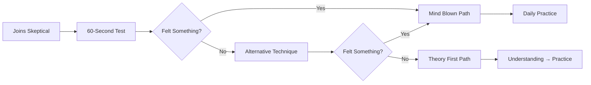
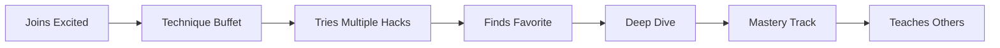
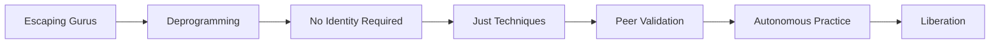

# Energy Labs Discord - User Journey & Onboarding Strategy

## 🎯 Core Philosophy
The onboarding should immediately demonstrate that this is different - no guru worship, no complex hierarchies, just practical energy techniques that work. Users should feel something real within their first 10 minutes.

---

## 🚪 Entry Points & First Impressions

### Option A: Immediate Experience (Direct Action)
**Philosophy**: "Feel first, explain later"

```
User joins → Welcome DM → Sent to #try-this-now channel
```

**Welcome DM from Bot:**
```
Welcome to Energy Labs! 🧪

No gurus. No mysticism. Just techniques that work.

Your first mission (takes 3 minutes):
→ Go to #try-this-now
→ Follow the pinned 60-second technique
→ Report what you felt in #first-impressions

If you felt something, you belong here.
If you felt nothing, try once more - most people need 2 attempts.

Ready? Let's see what you're capable of.
```

**#try-this-now Channel (View Only except for bot):**
```
📌 PINNED: The 60-Second Energy Ball Test

1. Rub your hands together for 10 seconds
2. Slowly pull them apart (6 inches)
3. Bring them together without touching
4. Pull apart again
5. Feel the resistance/magnetism?

That's bio-electricity. You just proved it exists.

React with:
⚡ - Felt something
🤔 - Not sure
❌ - Nothing yet

Based on your reaction, the bot will guide you next.
```

### Option B: Guided Onboarding (Discord's Community Feature)
**Philosophy**: "Learn the landscape, then explore"

Using Discord's built-in Community Onboarding:

**Welcome Screen Options:**
1. 🧪 **I want to feel energy NOW** → #instant-techniques
2. 🛡️ **I need protection from energy vampires** → #shield-training
3. 🤝 **I want to find practice partners** → #buddy-matching
4. 📚 **I want to understand the science** → #energy-theory
5. 🎯 **Show me everything** → #general-energy

**Onboarding Questions:**

*Question 1: What brought you here?*
- Curious if this is real
- Friend showed me something that worked
- Tired of fake spiritual BS
- Want practical energy techniques
- Escaping from wellness gurus

*Question 2: Experience level?*
- Never tried energy work
- Felt energy before but want more
- Some meditation/spiritual background
- Skeptical but open
- Already practicing, seeking community

*Question 3: Preferred learning style?*
- Just let me try things
- Explain the theory first
- I need a practice buddy
- Videos and demonstrations
- Text guides and instructions

**Based on answers, bot assigns:**
- Starting channel visibility
- Suggested first technique
- Optional buddy match
- Role: @explorer, @skeptic, @practitioner

### Option C: Challenge Entry (Gamified Hook)
**Philosophy**: "Prove it to yourself"

```
Welcome to Energy Labs! 🧪

THE 7-DAY CHALLENGE:
Master your first energy technique in one week.

Day 1: Feel energy (5 min)
Day 2: Strengthen sensation (10 min)
Day 3: Control the flow (10 min)
Day 4: First application (15 min)
Day 5: Consistency test (10 min)
Day 6: Teach someone else (20 min)
Day 7: Solo mastery (10 min)

Type /challenge accept to begin.
No payment. No catch. Just results.

🏆 73% complete Day 1
🏆 41% reach Day 7
🏆 100% who reach Day 7 stay

Will you make it?
```

---

## 🗺️ Channel Structure for New Users

### Immediate Visibility (All Options)
- 📋 **#rules** - Three simple rules
- 🧪 **#try-this-now** - Instant technique
- 💬 **#general-energy** - Main discussion
- ❓ **#help** - Questions and support
- 📢 **#announcements** - Updates

### After First Interaction
- 🎯 **#daily-practice** - Check-in channel
- 🤝 **#find-a-buddy** - Partner matching
- 🔬 **#lab-reports** - Share experiences
- 🎓 **#techniques** - Hack library

### After 7 Days
- 🛡️ **#shield-training** - Advanced protection
- 🧠 **#energy-theory** - Deeper understanding
- 🏆 **#challenges** - Community goals
- 🎪 **#practice-rooms** - Voice channels

### After 30 Days
- 🚀 **#innovations** - User discoveries
- 👥 **#teaching** - Peer education
- 🎓 **#graduation** - Liberation planning
- 🌍 **#spin-offs** - Independent groups

---

## 📜 The Three Rules (Pinned in #rules)

```
ENERGY LABS - THREE RULES

1. 🧪 TEST EVERYTHING
   Don't believe us. Don't believe anyone.
   Try it. Feel it. Decide for yourself.

2. 🤝 PEERS, NOT GURUS
   Everyone's learning. Everyone teaches.
   No masters. No disciples. Just practitioners.

3. 🎓 GRADUATION IS SUCCESS
   Our goal: You don't need us anymore.
   Learn the techniques. Master them. Leave.
   That's victory.

Break these rules = Exit
```

---

## 🤖 Bot Interactions for New Users

### First Hour Touchpoints

**Minute 1: Welcome DM**
Personalized based on entry choice

**Minute 5: First Technique Prompt**
```
Bot: Ready for your first energy experience? 
     Type /try energy-ball for a 3-minute guided session.
```

**Minute 10: Check-in**
```
Bot: How did that feel? React in #first-impressions:
     ⚡ Felt it clearly
     🌊 Felt something subtle
     🤔 Not sure
     ❌ Nothing
```

**Minute 20: Next Step**
```
Bot: Based on your experience, try:
     [Customized recommendation]
     
     Or explore #techniques for more options.
```

**Minute 60: Community Prompt**
```
Bot: Found someone else who just joined!
     @NewUser also started today.
     Try the energy ball together? 
     
     /buddy match @NewUser
```

---

## 🎨 Onboarding Paths

### Path 1: The Skeptic's Journey


### Path 2: The Eager Explorer


### Path 3: The Refugee (From Other Platforms)


---

## ❓ Key Questions for Decision

### 1. **Friction vs. Accessibility**
- **High Friction**: Require 60-second test before accessing channels?
  - ✅ Filters for serious practitioners
  - ✅ Creates immediate shared experience
  - ❌ Might lose curious lurkers
  
- **Low Friction**: Open access, gentle guidance?
  - ✅ More inclusive, less intimidating
  - ✅ People can observe before trying
  - ❌ May dilute community focus

**Recommendation?** Medium friction - strongly encourage but don't require

### 2. **Onboarding Style**
- **A) Immediate Experience**: Jump straight into techniques
- **B) Guided Tour**: Use Discord's onboarding for personalization
- **C) Challenge-Based**: 7-day structured program

**Recommendation?** Offer all three, let user choose their style

### 3. **Bot Personality**
- **Scientific**: "This is bio-electricity, measurable and reproducible"
- **Rebellious**: "Fuck gurus, let's learn real power"
- **Playful**: "Welcome to the energy playground!"
- **Mysterious**: "What you're about to discover changes everything"

**Recommendation?** Scientific with rebellious undertones

### 4. **Initial Channel Access**
- **Option 1**: See everything immediately (overwhelming?)
- **Option 2**: Progressive unlock based on activity
- **Option 3**: Choose your own adventure style
- **Option 4**: Time-based gradual reveal

**Recommendation?** Option 3 with time-based unlocks

### 5. **First Technique**
What should be the absolute first thing they try?

- **Energy Ball**: Classic, 90% feel something
- **Eye Massage**: Instant relief, practical
- **Pendulum Fingers**: Visual proof
- **Temperature Shift**: Feel warm/cool on command
- **Magnetic Hands**: Push/pull sensation

**Recommendation?** User choice from top 3 most reliable

### 6. **Buddy System**
When to introduce peer connection?

- **Immediately**: Match with another newcomer
- **After first success**: Celebrate together
- **Day 3**: Once committed
- **Optional always**: Only if requested

**Recommendation?** Offer after first success, make it celebratory

### 7. **Progress Tracking**
How visible should progress be?

- **Public by default**: Leaderboards, streaks visible
- **Private by default**: Only share if chosen
- **Hybrid**: Achievements public, details private

**Recommendation?** Private by default with opt-in sharing

---

## 🎯 Success Metrics for Onboarding

### Immediate (First Hour)
- 80% try at least one technique
- 60% report feeling something
- 40% interact in channels

### Short-term (First Week)
- 50% return Day 2
- 30% complete 7 days
- 20% help another newcomer

### Medium-term (First Month)
- 15% become daily practitioners
- 10% unlock shield technique
- 5% bring a friend

### Long-term (Graduation)
- Users master 3+ techniques
- Users teach others
- Users no longer need daily Discord
- Users create spin-off communities

---

## 🚀 Proposed Implementation

### Phase 1: MVP (Week 1)
1. Set up basic channel structure
2. Create welcome bot message
3. Pin first technique in #try-this-now
4. Simple /checkin command

### Phase 2: Onboarding Flow (Week 2)
1. Implement Discord Community Onboarding
2. Add role assignment based on choices
3. Create pathway-specific channels
4. Bot recommendations based on responses

### Phase 3: Engagement (Week 3)
1. Add buddy matching system
2. Implement 7-day challenge
3. Create progress tracking
4. Add peer validation

### Phase 4: Optimization (Week 4+)
1. A/B test different welcome messages
2. Track conversion through funnel
3. Iterate based on user feedback
4. Add more sophisticated routing

---

## 💡 Critical Decisions Needed

1. **Should we require email/portal signup before Discord?**
   - Pro: Better tracking, integrated experience
   - Con: Higher friction, may lose curious people

2. **How much explanation before first technique?**
   - Minimal: Just try it
   - Moderate: 2-3 sentences of context
   - Extensive: Full scientific explanation available

3. **Should channels be hidden until certain milestones?**
   - Helps focus and not overwhelm
   - But reduces transparency

4. **Verification system for techniques?**
   - Peer validation required to "unlock" next level?
   - Or completely open progression?

5. **How to handle skeptics who feel nothing?**
   - Multiple alternative techniques?
   - Theory/science channel?
   - Buddy match with successful practitioner?

---

## 🎪 The Ideal First Hour Experience

```
0:00 - Join server, see clean layout
0:01 - Receive warm, no-BS welcome
0:02 - Choose their path (try now/learn first/find buddy)
0:05 - Attempt first technique
0:08 - Feel something unexpected
0:10 - Share experience, get validated by peers
0:15 - Try second technique or go deeper
0:20 - Realize this is actually real
0:30 - Check out community discussions
0:45 - Set intention to return tomorrow
1:00 - Already planning which friend to tell
```

---

## 🔮 Alternative Radical Approaches

### The "Proof First" Model
- Before ANYTHING else, must complete 60-second technique
- Server literally doesn't unlock until they report results
- Extreme filtering but ensures commitment

### The "Science Lab" Model
- Frame everything as experiments
- Each user gets a "lab notebook" channel
- Track hypotheses and results
- Weekly "peer review" sessions

### The "Escape Room" Model
- Discord server is a puzzle to solve
- Each technique unlocks next area
- Graduation is "escaping" the server
- Gamified but aligned with liberation

### The "Fight Club" Model
- First rule: You must try before you talk
- Second rule: You must FEEL before you share
- Third rule: When you master it, you teach it
- Fourth rule: When you can teach it, you leave

---

## 📊 A/B Testing Options

We could run different onboarding for different invite links:

**Link A**: Direct experience path
**Link B**: Guided onboarding path  
**Link C**: Challenge-based path
**Link D**: Minimal friction exploration

Track:
- Conversion to first technique
- 7-day retention
- Community engagement
- Time to first peer interaction
- Graduation rate

---

## 🎯 Recommendation

**Go with Option A (Immediate Experience) enhanced with progressive disclosure:**

1. **Ultra-simple entry**: One channel visible: #try-this-now
2. **60-second commitment**: First technique mandatory
3. **React-based routing**: Bot guides based on experience
4. **Progressive unlock**: Channels appear as they progress
5. **Buddy option**: Offered after first success
6. **No overwhelm**: Maximum 5 channels visible initially

This maintains the "feel first, explain later" philosophy while preventing overwhelm and ensuring everyone has a shared foundational experience.

**The tagline for the journey:**
"In 60 seconds, you'll know if this is real. In 7 days, you'll have a new ability. In 30 days, you won't need us."