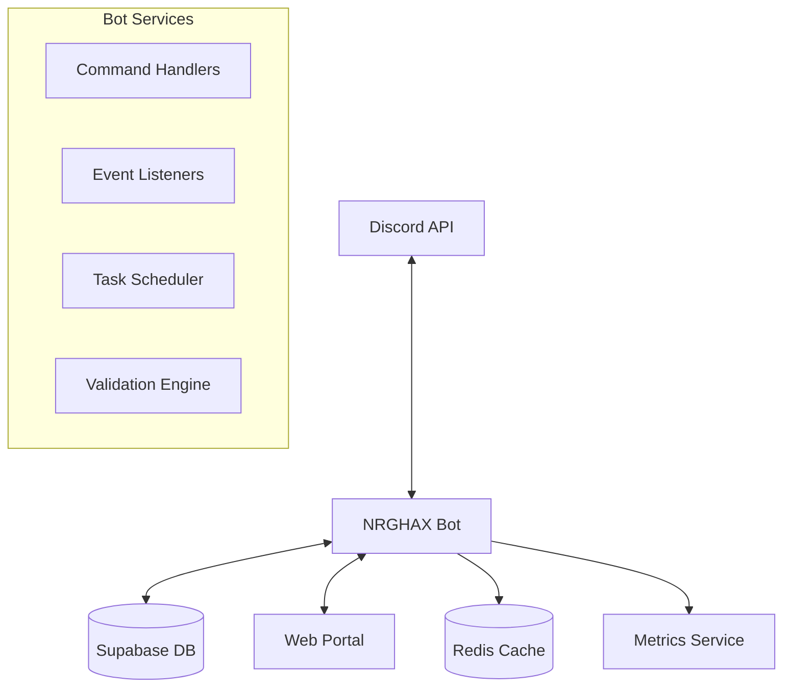
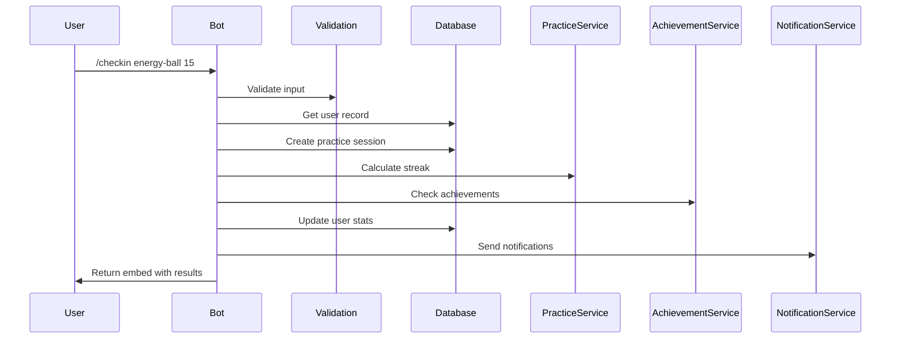
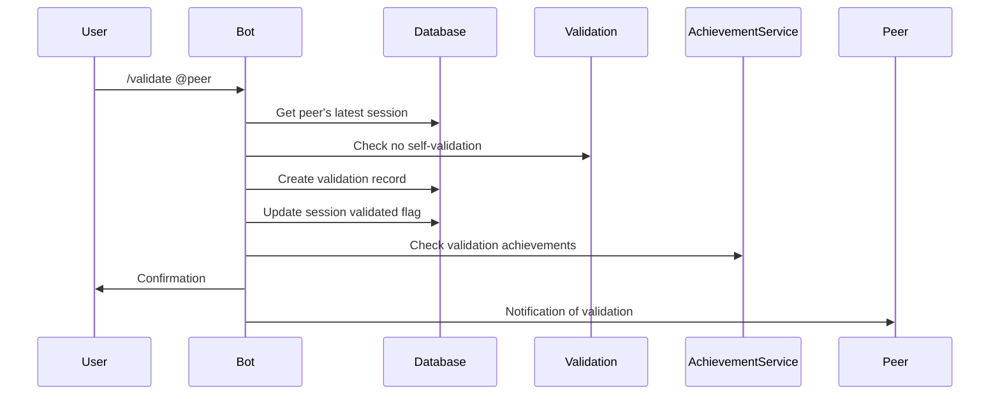

# NRGHAX Bot Technical Architecture

## 🏗️ System Overview



## 📁 Project Structure

```
nrgbot/
├── src/
│   ├── index.ts                 # Bot entry point
│   ├── bot.ts                   # Discord client setup
│   ├── commands/                # Slash command handlers
│   │   ├── index.ts
│   │   ├── core/
│   │   │   ├── checkin.ts
│   │   │   ├── streak.ts
│   │   │   ├── profile.ts
│   │   │   └── help.ts
│   │   ├── practice/
│   │   │   ├── start.ts
│   │   │   ├── end.ts
│   │   │   ├── journal.ts
│   │   │   └── techniques.ts
│   │   ├── social/
│   │   │   ├── validate.ts
│   │   │   ├── buddy.ts
│   │   │   ├── challenge.ts
│   │   │   └── invite.ts
│   │   └── advanced/
│   │       ├── graduate.ts
│   │       ├── teach.ts
│   │       ├── export.ts
│   │       └── shield-verify.ts
│   ├── events/                  # Discord event handlers
│   │   ├── ready.ts
│   │   ├── interactionCreate.ts
│   │   ├── messageCreate.ts
│   │   ├── voiceStateUpdate.ts
│   │   └── guildMemberAdd.ts
│   ├── services/                # Business logic
│   │   ├── database.ts
│   │   ├── practice.service.ts
│   │   ├── validation.service.ts
│   │   ├── achievement.service.ts
│   │   ├── graduation.service.ts
│   │   └── notification.service.ts
│   ├── database/                # Database layer
│   │   ├── client.ts            # Supabase client
│   │   ├── models/
│   │   │   ├── user.model.ts
│   │   │   ├── practice.model.ts
│   │   │   ├── achievement.model.ts
│   │   │   └── validation.model.ts
│   │   └── migrations/
│   ├── utils/                   # Helper functions
│   │   ├── embeds.ts            # Discord embed builders
│   │   ├── time.ts              # Time calculations
│   │   ├── validation.ts        # Input validation
│   │   └── cache.ts             # Redis caching
│   ├── config/                  # Configuration
│   │   ├── index.ts
│   │   ├── discord.ts
│   │   ├── database.ts
│   │   └── constants.ts
│   └── types/                   # TypeScript types
│       ├── discord.ts
│       ├── database.ts
│       └── index.ts
├── tests/                        # Test suites
│   ├── unit/
│   ├── integration/
│   └── mocks/
├── scripts/                      # Utility scripts
│   ├── deploy-commands.ts
│   ├── migrate.ts
│   └── seed.ts
├── docs/                         # Documentation
├── .env.example
├── .gitignore
├── package.json
├── tsconfig.json
├── Dockerfile
└── docker-compose.yml
```

## 💾 Database Schema

### Core Tables

```sql
-- Users table (shared with portal)
CREATE TABLE users (
    id UUID PRIMARY KEY DEFAULT gen_random_uuid(),
    email VARCHAR(255) UNIQUE,
    discord_id VARCHAR(255) UNIQUE NOT NULL,
    discord_username VARCHAR(255),
    discord_discriminator VARCHAR(10),
    created_at TIMESTAMP DEFAULT NOW(),
    last_checkin TIMESTAMP,
    streak_count INTEGER DEFAULT 0,
    total_practice_minutes INTEGER DEFAULT 0,
    graduated_at TIMESTAMP,
    is_alumni BOOLEAN DEFAULT FALSE,
    privacy_settings JSONB DEFAULT '{"streak_visibility": "public", "profile_visibility": "public"}'::jsonb,
    CONSTRAINT unique_discord_id UNIQUE (discord_id)
);

-- Hacks/Techniques table
CREATE TABLE hacks (
    id UUID PRIMARY KEY DEFAULT gen_random_uuid(),
    name VARCHAR(255) NOT NULL,
    slug VARCHAR(255) UNIQUE NOT NULL,
    description TEXT,
    content_url VARCHAR(500),
    duration_minutes INTEGER,
    category VARCHAR(100),
    level INTEGER DEFAULT 1,
    prerequisite_id UUID REFERENCES hacks(id),
    unlock_criteria JSONB,
    created_at TIMESTAMP DEFAULT NOW()
);

-- Practice sessions
CREATE TABLE practice_sessions (
    id UUID PRIMARY KEY DEFAULT gen_random_uuid(),
    user_id UUID REFERENCES users(id) ON DELETE CASCADE,
    hack_id UUID REFERENCES hacks(id),
    started_at TIMESTAMP NOT NULL,
    ended_at TIMESTAMP,
    duration_seconds INTEGER,
    notes TEXT,
    feedback_score INTEGER CHECK (feedback_score IN (-1, 0, 1)),
    is_validated BOOLEAN DEFAULT FALSE,
    created_at TIMESTAMP DEFAULT NOW(),
    INDEX idx_user_practice (user_id, created_at DESC),
    INDEX idx_hack_practice (hack_id, created_at DESC)
);

-- Peer validations
CREATE TABLE validations (
    id UUID PRIMARY KEY DEFAULT gen_random_uuid(),
    session_id UUID REFERENCES practice_sessions(id) ON DELETE CASCADE,
    validator_user_id UUID REFERENCES users(id),
    message TEXT,
    created_at TIMESTAMP DEFAULT NOW(),
    CONSTRAINT unique_validation UNIQUE (session_id, validator_user_id),
    CONSTRAINT no_self_validation CHECK (
        validator_user_id != (SELECT user_id FROM practice_sessions WHERE id = session_id)
    )
);

-- Achievements
CREATE TABLE achievements (
    id UUID PRIMARY KEY DEFAULT gen_random_uuid(),
    name VARCHAR(255) NOT NULL,
    slug VARCHAR(255) UNIQUE NOT NULL,
    description TEXT,
    icon_emoji VARCHAR(10),
    criteria_json JSONB NOT NULL,
    discord_role_id VARCHAR(255),
    is_liberation BOOLEAN DEFAULT FALSE,
    created_at TIMESTAMP DEFAULT NOW()
);

-- User achievements
CREATE TABLE user_achievements (
    id UUID PRIMARY KEY DEFAULT gen_random_uuid(),
    user_id UUID REFERENCES users(id) ON DELETE CASCADE,
    achievement_id UUID REFERENCES achievements(id),
    earned_at TIMESTAMP DEFAULT NOW(),
    announced BOOLEAN DEFAULT FALSE,
    CONSTRAINT unique_user_achievement UNIQUE (user_id, achievement_id)
);

-- Challenges
CREATE TABLE challenges (
    id UUID PRIMARY KEY DEFAULT gen_random_uuid(),
    name VARCHAR(255) NOT NULL,
    slug VARCHAR(255) UNIQUE NOT NULL,
    description TEXT,
    start_date TIMESTAMP NOT NULL,
    end_date TIMESTAMP NOT NULL,
    criteria_json JSONB NOT NULL,
    is_active BOOLEAN DEFAULT TRUE,
    created_at TIMESTAMP DEFAULT NOW()
);

-- Challenge participants
CREATE TABLE challenge_participants (
    id UUID PRIMARY KEY DEFAULT gen_random_uuid(),
    challenge_id UUID REFERENCES challenges(id) ON DELETE CASCADE,
    user_id UUID REFERENCES users(id) ON DELETE CASCADE,
    joined_at TIMESTAMP DEFAULT NOW(),
    completed_at TIMESTAMP,
    progress_data JSONB,
    CONSTRAINT unique_challenge_participant UNIQUE (challenge_id, user_id)
);

-- Referrals
CREATE TABLE referrals (
    id UUID PRIMARY KEY DEFAULT gen_random_uuid(),
    referrer_user_id UUID REFERENCES users(id),
    referred_user_id UUID REFERENCES users(id),
    invite_code VARCHAR(20) UNIQUE NOT NULL,
    created_at TIMESTAMP DEFAULT NOW(),
    activated_at TIMESTAMP,
    CONSTRAINT unique_referral UNIQUE (referred_user_id)
);

-- Teaching sessions
CREATE TABLE teaching_sessions (
    id UUID PRIMARY KEY DEFAULT gen_random_uuid(),
    teacher_user_id UUID REFERENCES users(id),
    hack_id UUID REFERENCES hacks(id),
    scheduled_at TIMESTAMP NOT NULL,
    description TEXT,
    max_participants INTEGER DEFAULT 10,
    discord_event_id VARCHAR(255),
    completed_at TIMESTAMP,
    feedback_score DECIMAL(3,2),
    created_at TIMESTAMP DEFAULT NOW()
);

-- Practice buddies
CREATE TABLE practice_buddies (
    id UUID PRIMARY KEY DEFAULT gen_random_uuid(),
    user1_id UUID REFERENCES users(id),
    user2_id UUID REFERENCES users(id),
    matched_at TIMESTAMP DEFAULT NOW(),
    practice_count INTEGER DEFAULT 0,
    last_practice TIMESTAMP,
    discord_channel_id VARCHAR(255),
    is_active BOOLEAN DEFAULT TRUE,
    CONSTRAINT unique_buddy_pair UNIQUE (user1_id, user2_id),
    CONSTRAINT different_users CHECK (user1_id != user2_id)
);

-- Shield verifications
CREATE TABLE shield_verifications (
    id UUID PRIMARY KEY DEFAULT gen_random_uuid(),
    user_id UUID REFERENCES users(id),
    question1_answer TEXT NOT NULL,
    question2_answer TEXT NOT NULL,
    question3_answer TEXT NOT NULL,
    submitted_at TIMESTAMP DEFAULT NOW(),
    verification_count INTEGER DEFAULT 0,
    verified_at TIMESTAMP,
    is_verified BOOLEAN DEFAULT FALSE
);

-- Graduation applications
CREATE TABLE graduation_applications (
    id UUID PRIMARY KEY DEFAULT gen_random_uuid(),
    user_id UUID REFERENCES users(id),
    applied_at TIMESTAMP DEFAULT NOW(),
    criteria_met JSONB NOT NULL,
    ceremony_date TIMESTAMP,
    completed_at TIMESTAMP,
    alumni_message TEXT,
    CONSTRAINT unique_graduation UNIQUE (user_id)
);

-- Innovation lab submissions
CREATE TABLE innovations (
    id UUID PRIMARY KEY DEFAULT gen_random_uuid(),
    creator_user_id UUID REFERENCES users(id),
    name VARCHAR(255) NOT NULL,
    description TEXT NOT NULL,
    instructions TEXT,
    validation_count INTEGER DEFAULT 0,
    accepted_at TIMESTAMP,
    is_accepted BOOLEAN DEFAULT FALSE,
    created_at TIMESTAMP DEFAULT NOW()
);
```

### Indexes for Performance

```sql
-- Performance indexes
CREATE INDEX idx_users_discord ON users(discord_id);
CREATE INDEX idx_users_streak ON users(streak_count DESC);
CREATE INDEX idx_sessions_user_date ON practice_sessions(user_id, created_at DESC);
CREATE INDEX idx_validations_session ON validations(session_id);
CREATE INDEX idx_achievements_user ON user_achievements(user_id);
CREATE INDEX idx_challenges_active ON challenges(is_active, end_date);
CREATE INDEX idx_referrals_code ON referrals(invite_code);
CREATE INDEX idx_teaching_scheduled ON teaching_sessions(scheduled_at);
```

## 🔧 Service Architecture

### Command Handler Pattern

```typescript
// Base command structure
interface Command {
    data: SlashCommandBuilder;
    execute: (interaction: CommandInteraction) => Promise<void>;
    autocomplete?: (interaction: AutocompleteInteraction) => Promise<void>;
}

// Example: Checkin command
export class CheckinCommand implements Command {
    data = new SlashCommandBuilder()
        .setName('checkin')
        .setDescription('Record your daily practice')
        .addStringOption(option =>
            option.setName('hack')
                .setDescription('Technique practiced')
                .setAutocomplete(true))
        .addIntegerOption(option =>
            option.setName('duration')
                .setDescription('Practice time in minutes'))
        .addStringOption(option =>
            option.setName('notes')
                .setDescription('Session notes'));

    async execute(interaction: CommandInteraction) {
        // Implementation
    }

    async autocomplete(interaction: AutocompleteInteraction) {
        // Hack name autocomplete
    }
}
```

### Service Layer Pattern

```typescript
// Practice service example
export class PracticeService {
    async recordSession(
        userId: string,
        hackId: string,
        duration: number,
        notes?: string
    ): Promise<PracticeSession> {
        // Business logic
        // 1. Validate user and hack
        // 2. Create session record
        // 3. Update streak
        // 4. Check achievements
        // 5. Send notifications
        return session;
    }

    async calculateStreak(userId: string): Promise<number> {
        // Streak calculation logic
    }

    async checkUnlocks(userId: string): Promise<Hack[]> {
        // Check for newly unlocked techniques
    }
}
```

### Event Handler Pattern

```typescript
// Voice state update handler
export class VoiceStateHandler {
    async handle(oldState: VoiceState, newState: VoiceState) {
        if (this.isJoiningPracticeRoom(oldState, newState)) {
            await this.announcePracticeSession(newState);
        }
    }

    private isJoiningPracticeRoom(
        oldState: VoiceState,
        newState: VoiceState
    ): boolean {
        return !oldState.channel && 
               newState.channel?.name.includes('practice');
    }
}
```

## 🔄 Data Flow

### Checkin Flow


### Validation Flow


## 🚀 Deployment Architecture

### Docker Compose Setup

```yaml
version: '3.8'

services:
  bot:
    build: .
    environment:
      - NODE_ENV=production
      - DISCORD_TOKEN=${DISCORD_TOKEN}
      - SUPABASE_URL=${SUPABASE_URL}
      - SUPABASE_KEY=${SUPABASE_KEY}
      - REDIS_URL=redis://redis:6379
    depends_on:
      - redis
    restart: unless-stopped

  redis:
    image: redis:alpine
    volumes:
      - redis-data:/data
    restart: unless-stopped

  scheduler:
    build: 
      context: .
      dockerfile: Dockerfile.scheduler
    environment:
      - NODE_ENV=production
      - SUPABASE_URL=${SUPABASE_URL}
      - SUPABASE_KEY=${SUPABASE_KEY}
    restart: unless-stopped

volumes:
  redis-data:
```

### Environment Configuration

```bash
# .env.example
# Discord Configuration
DISCORD_TOKEN=your_bot_token
DISCORD_CLIENT_ID=your_client_id
DISCORD_GUILD_ID=your_guild_id

# Database Configuration
SUPABASE_URL=https://your-project.supabase.co
SUPABASE_KEY=your_anon_key
SUPABASE_SERVICE_KEY=your_service_key

# Redis Configuration
REDIS_URL=redis://localhost:6379

# Portal Configuration
PORTAL_URL=https://nrghax.com
PORTAL_WEBHOOK_SECRET=shared_secret

# Feature Flags
ENABLE_ANALYTICS=true
ENABLE_ACHIEVEMENTS=true
ENABLE_GRADUATION=true

# Rate Limiting
COMMAND_RATE_LIMIT=5
COMMAND_RATE_WINDOW=10000

# Logging
LOG_LEVEL=info
LOG_FORMAT=json
```

## 🔐 Security Considerations

### Rate Limiting
```typescript
const rateLimiter = new Map<string, number[]>();

function checkRateLimit(userId: string): boolean {
    const now = Date.now();
    const userLimits = rateLimiter.get(userId) || [];
    
    // Remove old entries
    const recentLimits = userLimits.filter(
        time => now - time < RATE_WINDOW
    );
    
    if (recentLimits.length >= RATE_LIMIT) {
        return false;
    }
    
    recentLimits.push(now);
    rateLimiter.set(userId, recentLimits);
    return true;
}
```

### Input Validation
```typescript
export class ValidationService {
    validateHackName(name: string): boolean {
        return /^[a-z0-9-]+$/.test(name) && name.length <= 50;
    }
    
    validateNotes(notes: string): boolean {
        return notes.length <= 500 && !this.containsMalicious(notes);
    }
    
    private containsMalicious(text: string): boolean {
        // Check for SQL injection, scripts, etc.
        const patterns = [/<script/i, /javascript:/i, /on\w+=/i];
        return patterns.some(pattern => pattern.test(text));
    }
}
```

## 📊 Monitoring & Analytics

### Liberation Metrics
```typescript
interface LiberationMetrics {
    totalUsers: number;
    activeUsers: number;
    graduatedUsers: number;
    averageTimeToGraduation: number;
    techniquesmastered: number;
    peerValidationsGiven: number;
    teachingSessionsHeld: number;
    spinoffCommunitiesCreated: number;
}
```

### Health Checks
```typescript
app.get('/health', async (req, res) => {
    const health = {
        uptime: process.uptime(),
        discord: client.ws.status === 0,
        database: await checkDatabaseConnection(),
        redis: await checkRedisConnection(),
        timestamp: Date.now()
    };
    
    res.status(health.discord && health.database ? 200 : 503)
       .json(health);
});
```

## 🧪 Testing Strategy

### Unit Tests
- Command handlers
- Service methods
- Utility functions
- Validation logic

### Integration Tests
- Database operations
- Discord API interactions
- Service interactions
- Achievement triggers

### E2E Tests
- Complete user flows
- Graduation process
- Data export
- Challenge participation

## 🔄 CI/CD Pipeline

```yaml
# .github/workflows/deploy.yml
name: Deploy Bot

on:
  push:
    branches: [main]

jobs:
  test:
    runs-on: ubuntu-latest
    steps:
      - uses: actions/checkout@v2
      - uses: actions/setup-node@v2
      - run: npm ci
      - run: npm test
      - run: npm run lint

  deploy:
    needs: test
    runs-on: ubuntu-latest
    steps:
      - uses: actions/checkout@v2
      - name: Deploy to production
        run: |
          docker build -t nrgbot .
          docker push registry/nrgbot
          kubectl rollout restart deployment/nrgbot
```

## 🎯 Performance Optimization

### Caching Strategy
- User data: 5 minutes
- Hack list: 1 hour
- Achievements: 30 minutes
- Leaderboards: 10 minutes

### Database Optimization
- Connection pooling
- Prepared statements
- Batch operations
- Materialized views for analytics

### Discord Optimization
- Webhook batching
- Embed caching
- Deferred responses for heavy operations
- Sharding for scale

## 📚 Key Dependencies

```json
{
  "dependencies": {
    "discord.js": "^14.13.0",
    "@supabase/supabase-js": "^2.38.0",
    "redis": "^4.6.0",
    "node-cron": "^3.0.2",
    "date-fns": "^2.30.0",
    "zod": "^3.22.0",
    "winston": "^3.11.0"
  },
  "devDependencies": {
    "@types/node": "^20.10.0",
    "typescript": "^5.3.0",
    "tsx": "^4.6.0",
    "vitest": "^1.0.0",
    "eslint": "^8.55.0",
    "prettier": "^3.1.0"
  }
}
```

## 🚦 Ready Checklist

- [ ] Discord application created
- [ ] Bot added to server with proper permissions
- [ ] Supabase project initialized
- [ ] Database schema deployed
- [ ] Redis instance available
- [ ] Environment variables configured
- [ ] Commands registered
- [ ] Monitoring setup
- [ ] Error tracking configured
- [ ] Backup strategy defined