# NRGHAX Discord Bot - Development Guidelines

## 🎯 Project Mission

You are building a Discord bot that serves as the community engine for NRGHAX - a liberation-focused platform teaching bio-energy sovereignty. This bot is intentionally designed to help users become independent, celebrating when they no longer need the platform.

## 🛡️ Core Concept: The Liberation Paradox

We're creating an engagement system that:
1. **Captures** users from parasitic platforms/habits
2. **Teaches** bio-energy techniques for personal sovereignty
3. **Celebrates** when users graduate and leave
4. **Demonstrates** conscious collaboration over dependency

## 🤖 Bot Philosophy

### What This Bot IS
- A practice companion that tracks progress
- A peer validation system for authentic growth
- A celebration engine for independence milestones
- A tool that works without creating identity dependency

### What This Bot IS NOT
- A retention mechanism to keep users hooked
- A gamification system prioritizing engagement over growth
- A guru platform elevating teachers over practitioners
- A social status system creating artificial hierarchies

## 💻 Development Principles

### 1. Liberation Over Retention
- Every feature should help users become independent
- Graduation is success, not failure
- Export functions are first-class features
- Offline practice is encouraged

### 2. Peer Validation Over Authority
- No special "teacher" or "master" roles
- Validation comes from practice partners
- Experience shared horizontally, not vertically
- Community wisdom over individual expertise

### 3. Tools Over Identity
- Users learn techniques, not join a movement
- No branded language or insider terminology
- Methods work outside the platform
- Success means not needing the Discord

### 4. Transparency Over Mystery
- Open about psychological mechanisms
- Explain why features work
- No hidden retention tactics
- Clear graduation criteria

## 🔧 Technical Guidelines

### Command Design
```typescript
// GOOD: Tool-focused, action-oriented
/practice start energy-ball
/shield activate
/validate @user
/export my-data

// BAD: Identity-forming, status-seeking
/level-up
/earn-badge  
/join-clan
/worship-guru
```

### Database Patterns
```typescript
// GOOD: Track actions, not identity
{
  practice_minutes: 1247,
  techniques_learned: ['energy_ball', 'shield'],
  peer_validations: 23,
  graduation_eligible: true
}

// BAD: Create platform dependency
{
  user_level: 47,
  loyalty_points: 9999,
  days_since_joining: 365,
  platform_rank: "Grand Master"
}
```

### Notification Strategy
```typescript
// GOOD: Celebrate progress toward independence
"🎉 You've maintained your shield for 7 days straight! 
You're developing automatic protection."

// BAD: Create FOMO or dependency
"⚠️ You haven't checked in for 2 days! 
Your streak is at risk! Come back now!"
```

## 🎨 Feature Implementation

### When Adding New Features, Ask:
1. **Does this teach a transferable skill?**
   - ✅ Shield visualization technique
   - ❌ Platform-specific mini-game

2. **Does this work without Discord?**
   - ✅ Energy practice timer
   - ❌ Discord-only achievements

3. **Does this celebrate independence?**
   - ✅ Graduation ceremony command
   - ❌ Annual membership rewards

4. **Does this encourage peer learning?**
   - ✅ Practice buddy matching
   - ❌ Guru consultation booking

## 📊 Success Metrics

### Track These (Liberation Metrics)
- Users reaching graduation criteria
- Successful data exports
- Peer teaching sessions held
- Spin-off communities created
- Users practicing without check-ins

### Don't Track These (Retention Metrics)
- Daily active users (as primary metric)
- Time spent in Discord
- Message count per user
- Feature addiction rates
- Churn prevention

## 🚀 Implementation Priorities

### Phase 1: Foundation (Must Have)
- Basic practice tracking
- Peer validation system
- Data export functionality
- Graduation eligibility checker

### Phase 2: Growth (Should Have)
- Practice buddy matching
- Teaching session scheduler
- Challenge system (short-term)
- Progress visualization

### Phase 3: Evolution (Nice to Have)
- Spin-off community tools
- Advanced practice analytics
- Biometric integration (optional)
- AI practice insights

## 🔐 Privacy & Security

### Data Principles
- Collect minimum necessary data
- User controls all visibility settings
- Easy, complete data deletion
- No selling or sharing user data
- Transparent about what's stored

### Security Practices
- Rate limit all commands
- Validate all user inputs
- No storing sensitive health data
- Regular security audits
- Open source codebase

## 🎯 The North Star Test

Before implementing ANY feature, it must pass:

**Does it teach energy sovereignty?**
- Users gain skills that work anywhere

**Does it encourage peer learning?**
- Knowledge flows horizontally

**Does it celebrate graduation?**
- Leaving is winning

**Does it work without the platform?**
- Independence is the goal

## 💡 Example Implementations

### GOOD: Graduation Command
```typescript
// Celebrates users becoming independent
async function graduationCheck(userId: string) {
  const criteria = await checkGraduationCriteria(userId);
  if (criteria.allMet) {
    await ceremonialGraduation(userId);
    await grantAlumniRole(userId);
    await celebrateInChannel(userId);
    // User keeps access but is celebrated for not needing it
  }
}
```

### BAD: Streak Punishment
```typescript
// DON'T DO THIS - Creates dependency through fear
async function streakBreaker(userId: string) {
  // ❌ Removes all progress
  // ❌ Sends guilt-inducing messages
  // ❌ Makes user start over
  // This creates platform dependency, not growth
}
```

## 🌟 Remember

We're building humanity's first intentionally liberating engagement system. Every line of code should serve the mission of creating sovereign, empowered practitioners who eventually don't need us.

Success is measured by the number of users who graduate, not the number who stay.

## 📚 Required Reading

Before developing features, understand:
1. [Double Torus Shield](../../docs/bio_energy/double_torus_shield.md) - The primary protection technique
2. [Egregore Documentation](../../docs/bio_energy/egregores.md) - What we're protecting against
3. [Liberation Paradox](../../strategy/liberation_paradox.md) - Why we celebrate users leaving

## 🤝 Contribution Guidelines

### Code Review Checklist
- [ ] Feature enables independence, not dependency
- [ ] No dark patterns or retention tricks
- [ ] Peer validation over authority systems
- [ ] Works without Discord when possible
- [ ] Celebrates progress toward graduation
- [ ] Transparent about mechanisms
- [ ] Respects user privacy and agency

### Testing Priorities
1. **Liberation flows** - Graduation, export, leaving
2. **Peer systems** - Validation, matching, teaching
3. **Practice tools** - Timers, tracking, progress
4. **Privacy features** - Deletion, export, visibility

## 🚦 Quick Decision Framework

**Should we build this feature?**

```mermaid
graph TD
    A[New Feature Idea] --> B{Teaches Sovereignty?}
    B -->|No| X[❌ Don't Build]
    B -->|Yes| C{Works Offline?}
    C -->|No| X
    C -->|Yes| D{Celebrates Graduation?}
    D -->|No| X
    D -->|Yes| E[✅ Build It!]
```



## 🎪 The Ultimate Vision

A Discord bot that becomes obsolete by design - teaching users skills that make them sovereign, connecting them with peers for mutual growth, and celebrating when they achieve independence.

Every user who leaves with gratitude is a victory.
Every spin-off community is a success.
Every person practicing without the platform is the goal.

**Build for liberation, not retention.**